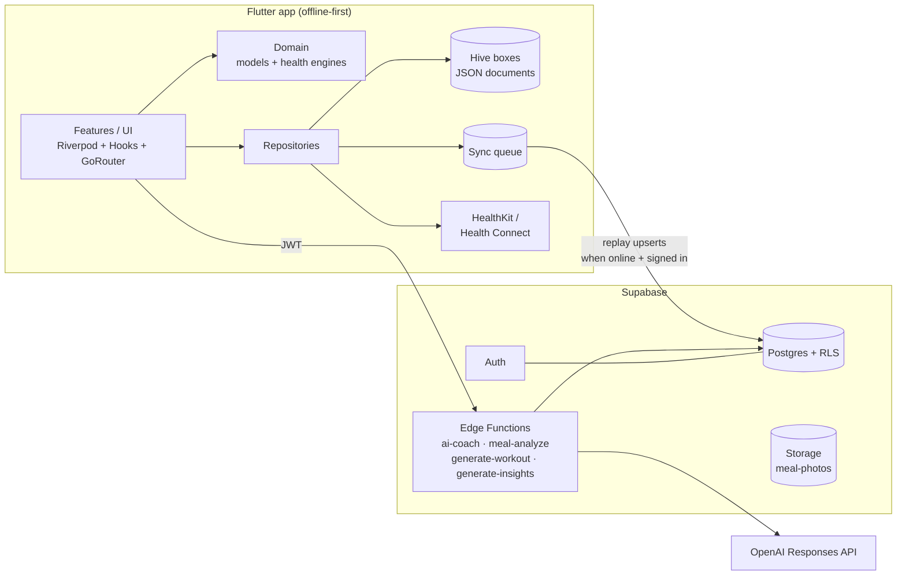

# Bodi architecture

## System overview



## Principles

1. **Offline-first.** Hive is the source of truth on-device; every write
   lands locally first and is queued as an idempotent upsert. The queue
   replays in order whenever connectivity returns and the user is signed
   in, so the app is fully usable with no account and no network.
2. **Pure domain core.** Everything that computes health values —
   `HealthEngine`, `DailyScoreEngine`, `InsightRulesEngine` — is pure Dart
   with zero Flutter or IO dependencies, which is why it has the densest
   test coverage.
3. **AI at the edge, never in the app.** The app holds no OpenAI key.
   Edge functions authenticate the caller's JWT, meter usage
   (free tier allowance vs premium), build prompts from the payload the
   user's device chose to send, and call the OpenAI Responses API — with
   structured outputs for meals/workouts/insights and SSE streaming for
   the coach.
4. **Every AI feature has an offline fallback.** Text meal logging falls
   back to the bundled food database; workouts fall back to curated
   templates; insights fall back to the deterministic rules engine; the
   coach degrades to an honest "connect to use AI" message.

## App layering (`app/lib/`)

```
core/       config, theme, router, shared widgets, error types, Hive store, DI providers
domain/     models (Freezed) + health engines — pure Dart
data/       repositories, Supabase/AI/activity/notification services, sync queue
features/   feature-first UI + controllers (onboarding, dashboard, meals,
            coach, health, habits, insights, workouts, reminders, reports, profile, auth)
```

Dependency rule: `features → data → domain ← core`. Features never touch
Supabase or Hive directly — always through a repository.

### State management

Riverpod with manual providers. Repositories are plain classes injected via
`Provider`; screens watch small derived providers
(`dashboardProvider`, `mealsListProvider`, …) that are invalidated by the
controllers after each mutation. Chat uses a `Notifier` for streaming
updates.

### Serialization

Freezed + json_serializable with `field_rename: snake` globally, so a
model's `toJson()` is simultaneously its Hive document and its Supabase row
payload — one format everywhere, no mapping layer to drift.

## Backend (`supabase/`)

- **Schema** (`migrations/...initial_schema.sql`): user-owned tables key on
  client-generated UUIDs (offline creation) plus `user_id`; documents that
  the app owns wholesale (profile, nutrition, exercises) are `jsonb`;
  frequently-filtered fields (type, timestamps) are real columns with
  indexes. Community tables (friendships, groups, challenges) and
  `subscriptions`/`ai_usage` for premium metering.
- **RLS** (`...rls_policies.sql`): owner-only CRUD applied uniformly to
  personal tables; `foods` is world-readable reference data;
  group content is visible to members only (via a `security definer`
  membership check to avoid recursive policies); storage policies scope
  meal photos to `<user_id>/…` paths.
- **Seed** (`seed.sql`): the African-first food database, generated from
  `app/assets/data/foods.json` (kept in sync — same file drives offline
  search).
- **Edge functions**: Deno, shared helpers in `_shared/mod.ts`
  (auth, metering, OpenAI client, error mapping).

## Testing

- **Unit**: health engine formulas (WHO/Mifflin/RFM cutoffs, caps and
  floors), daily score weighting, insight rules.
- **Repository**: real Hive round-trips including nested Freezed models,
  day aggregation and streak semantics (unscheduled days skip, unfinished
  today doesn't break).
- **Widget**: core design-system widgets and onboarding inputs.
- **CI**: migrations + seed applied to a real Postgres with Supabase shims;
  edge functions typechecked with Deno.
