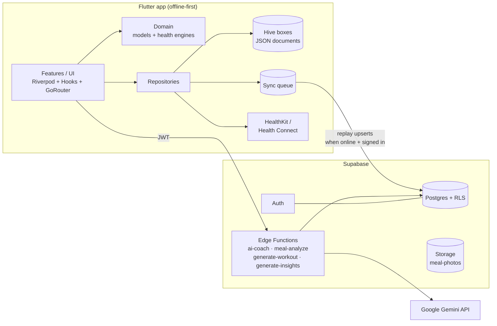

# Sanora architecture

## System overview



## Principles

1. **Offline-first, but not one-way.** Hive is the source of truth on-device;
   every write lands locally first and is queued as an idempotent upsert. The
   queue replays in order whenever connectivity returns and the user is signed
   in, so the app is fully usable with no account and no network.
   `SyncService.pull()` is the other half: signing in or launching restores the
   boxes from Postgres, skipping rows the device has not pushed yet, so a
   reinstall or a second device gets the user's history back.
   A write the server keeps rejecting is retired to a dead-letter box after
   five attempts rather than blocking everything queued behind it, and
   `SyncStatus` carries that state to the UI — a backup claim nothing can
   verify is worse than no claim.
2. **Pure domain core.** Everything that computes health values —
   `HealthEngine`, `DailyScoreEngine`, `InsightRulesEngine` — is pure Dart
   with zero Flutter or IO dependencies, which is why it has the densest
   test coverage.
3. **AI at the edge, never in the app.** The app holds no Gemini key.
   Edge functions authenticate the caller's JWT, meter usage
   (free tier allowance vs premium), build prompts from the payload the
   user's device chose to send, and call the Google Gemini API — with
   `responseSchema` structured output for meals/workouts/insights and
   `streamGenerateContent` SSE for the coach.
   The provider lives entirely behind `_shared/mod.ts`: the app posts the same
   payloads to the same function names and knows nothing about who answers,
   which is why swapping OpenAI for Gemini touched no Dart at all.
4. **Every AI feature has an offline fallback.** Text meal logging falls
   back to the bundled food database; workouts fall back to curated
   templates; insights fall back to the deterministic rules engine; the
   coach degrades to an honest "connect to use AI" message.
   These hang on `AiService` translating transport errors into
   `AiUnavailableFailure` and quota refusals into `QuotaFailure`. Callers
   switch on those types, so a raw `DioException` escaping the service
   silently disables every fallback — which is exactly what used to happen to
   signed-in users with no connectivity.

## Localization (`app/lib/l10n/`)

English and French, because Cameroon is officially bilingual — French is not
an optional extra here.

Strings live in **fragments**, one pair per feature area
(`fragments/meals_en.arb` + `meals_fr.arb`), merged into the generator's input
by `tools/merge_arb.py`. The fragments exist so several people can extract
strings at once without colliding in one enormous file; `000_base_*` holds the
shared keys and merges first. The merge **fails** on a duplicate key and on any
English key missing its French counterpart, because a silent fallback ships a
half-translated screen that nobody notices.

```
python3 tools/merge_arb.py && flutter gen-l10n
```

`app_en.arb`, `app_fr.arb` and `app_localizations*.dart` are all generated and
gitignored — edit the fragments. CI regenerates before analyze.

Two boundaries worth keeping:

- **`domain/` stays English and Flutter-free.** The enums keep their plain
  `label` fields so the health engines remain testable without a widget
  binding; `core/l10n/enum_labels.dart` provides `someEnum.labelOf(context)`
  for the UI. A raw `.label` reaching a screen is a bug.
- **`Failure` carries finished copy, not a code.** It is sealed in `core/`, so
  controllers that throw one take an `L` and resolve the message at throw time
  rather than at render time.

`main()` calls `initializeDateFormatting()` and `SanoraApp` sets
`Intl.defaultLocale` from inside `Localizations` — without both, every
`DateFormat` silently renders English month and weekday names under French.

## App layering (`app/lib/`)

```
core/       config, theme, router, shared widgets, error types, Hive store, DI providers
domain/     models (Freezed) + health engines — pure Dart
data/       repositories, Supabase/AI/activity/notification services, sync queue
features/   feature-first UI + controllers (onboarding, dashboard, meals,
            coach, health, habits, insights, workouts, reminders, reports, profile, auth)
```

Dependency rule: `features → data → domain ← core`. Features never touch
Supabase or Hive directly — always through a repository.

### State management

Riverpod with manual providers. Repositories are plain classes injected via
`Provider`; screens watch small derived providers
(`dashboardProvider`, `mealsListProvider`, …) that are invalidated by the
controllers after each mutation. Chat uses a `Notifier` for streaming
updates.

### Serialization

Freezed + json_serializable with `field_rename: snake` globally, so a
model's `toJson()` is simultaneously its Hive document and its Supabase row
payload — one format everywhere, no mapping layer to drift.

## Backend (`supabase/`)

- **Schema** (`migrations/...initial_schema.sql`): user-owned tables key on
  client-generated UUIDs (offline creation) plus `user_id`; documents that
  the app owns wholesale (profile, nutrition, exercises) are `jsonb`;
  frequently-filtered fields (type, timestamps) are real columns with
  indexes. Community tables (friendships, groups, challenges) and
  `subscriptions`/`ai_usage` for premium metering.
- **RLS** (`...rls_policies.sql`): owner-only CRUD applied uniformly to
  personal tables; `foods` is world-readable reference data;
  group content is visible to members only (via a `security definer`
  membership check to avoid recursive policies); storage policies scope
  meal photos to `<user_id>/…` paths.
- **Seed** (`seed.sql`): the African-first food database, generated from
  `app/assets/data/foods.json` (kept in sync — same file drives offline
  search).
- **Metering and erasure** (`...metering_and_account_deletion.sql`):
  `consume_ai_call(user_id, limit)` checks the subscription and increments the
  daily counter in one statement — reading the count and writing it back
  separately let two concurrent requests both pass the same check, so the free
  allowance leaked under exactly the concurrency it exists to limit. Execute is
  revoked from `anon`/`authenticated`; only the service role meters.
  `delete_account()` is `SECURITY DEFINER`, deletes the caller's meal photos
  and their `auth.users` row, and lets the existing `on delete cascade` take
  the rest. Apple 5.1.1(v) and GDPR both require it to be reachable in-app.
- **Edge functions**: Deno, shared helpers in `_shared/mod.ts`
  (auth, metering, Gemini client, error mapping). `consumeAiAllowance` is a
  thin wrapper over the RPC above — do not reintroduce a read-then-write here.
  Schemas are written as plain JSON Schema and passed through `geminiSchema()`,
  which strips `additionalProperties`/`strict` — Gemini's `responseSchema`
  accepts only an OpenAPI subset and rejects them.

## Testing

- **Unit**: health engine formulas (WHO/Mifflin/RFM cutoffs, caps and
  floors), daily score weighting, insight rules.
- **Repository**: real Hive round-trips including nested Freezed models,
  day aggregation and streak semantics (unscheduled days skip, unfinished
  today doesn't break).
- **Widget**: core design-system widgets and onboarding inputs.
- **Golden**: design-system widgets (StatTile, ProgressRing, EmptyState) in
  light and dark, with the brand fonts loaded via `flutter_test_config.dart`.
  Regenerate with `flutter test --update-goldens`; CI pins Flutter 3.38.5 so
  goldens don't drift across engine versions. Keep that pin equal to what
  developers run locally — the goldens fail on any other engine.
- **CI**: migrations + seed applied to a real Postgres with Supabase shims;
  edge functions typechecked with Deno.

The community RPCs (`supabase/migrations/...community_rpcs.sql`) were
validated the same way — applied to a shimmed Postgres and exercised with
three users to confirm friend requests, group membership, challenge
leaderboards, and that display names and private-group challenges stay
hidden from unconnected users.
